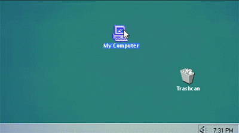

### Hello world! I am Gabe :)

## About me 

 Hi, my name is Gabriel but you can call me Gabe or even Gabi. I am currently studying at a very cool school called 42-Porto. I love programming and everything technology wise, from restarting the internet router to writing complex "Hello world!" programs. Speaking of which, here is some footage of me working: 

<!--
**hiimgabe/hiimgabe** is a ✨ _special_ ✨ repository because its `README.md` (this file) appears on your GitHub profile.
Here are some ideas to get you started:

- 🔭 I’m currently working on ...
- 🌱 I’m currently learning ...
- 👯 I’m looking to collaborate on ...
- 🤔 I’m looking for help with ...
- 💬 Ask me about ...
- 📫 How to reach me: ...
- 😄 Pronouns: ...
- ⚡ Fun fact: ...
-->
